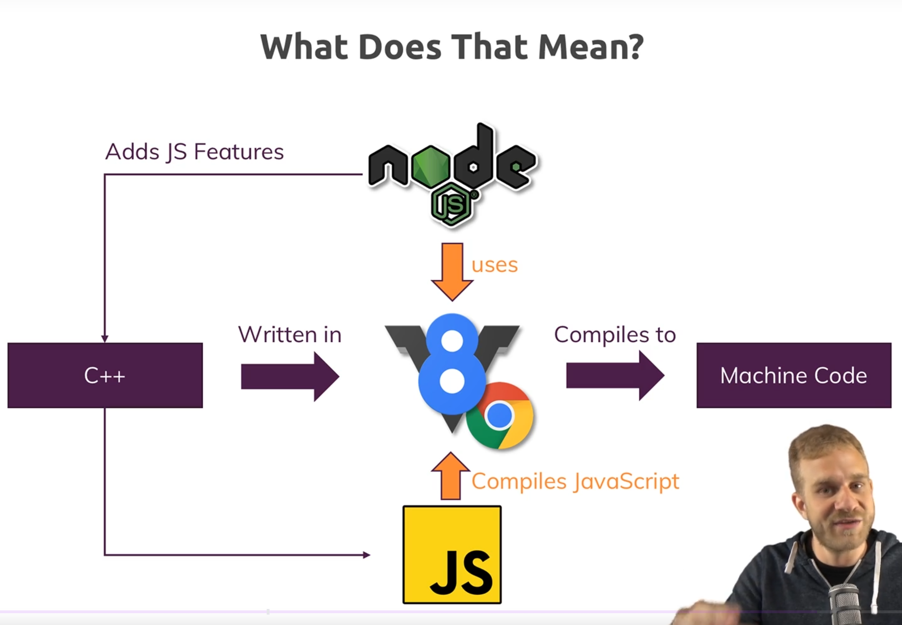
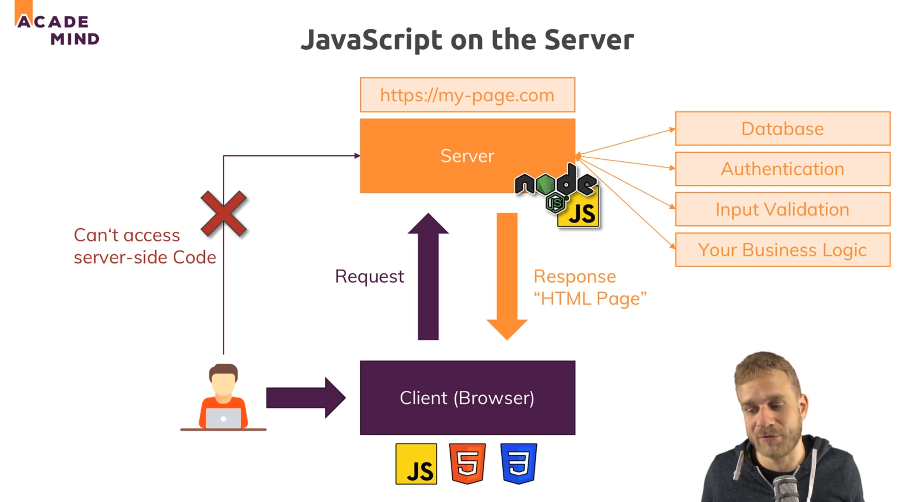
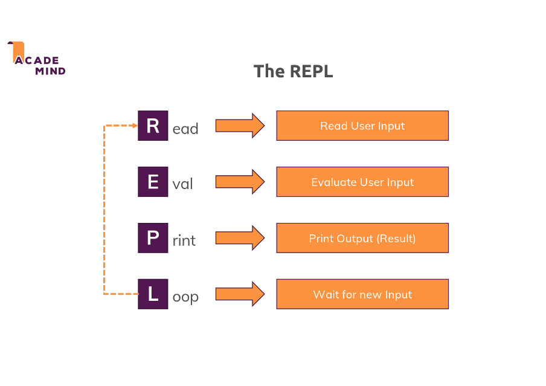

# Section 01: Introduction

## What is the Nodejs?

### Nodejs Concepts

- It Is a **Javascript Runtime Environment**
- So it basically takes Javascript and puts it into a different environment
- It allows you to run Javascript code on the server, in theory not just on the server but on any machine though.
- It basically allows you to run Javascript not just in the browser but anywhere else like a normal programs on your computer or some computer in the Internet effectively that run on servers which are just computers run somewhere on the Internet

**What Does That Mean?**

This means that we can use nodejs to run javascript outside of the browser

**How does that work technically?**

Nodejs users V8 and V8 simply is the name of the JavaScript Engine built by Google that runs Javascript in the browser.

**What does an engine mean?**

<div style="text-align:center">

</div>

Well it simply means that engine takes a Javascript code, the code running in the browser then or in nodes's case which builds up on V8, also the Nodejs javascript Code, It takes that javascript code and compiles it to machine code

- **V8 Itself is written in C++**

Nodejs basically takes that V8 codebase which is written in C++ and adds certain features like. ex. working with your local file system, opening files, reading files, deleting files, these are all things which are not possible in the browser

## 5: Understanding the Role & Usage of Node.js

### Javascript On The Server

<div style="text-align:center">

</div>

## 7: How To Get The Most Out Of The Course

<div style="text-align:center">

</div>

1. Watch the Video in Focus without Distractions
    - At Your Speed Pause & Rewind!
2. Jump back to older sections or Videos
    - to reiterate concepts you learned before
3. Code Along & Do the Exercises!
    - Try to solve these things on your OWN!
4. Make Sure to Google for problems If you can't solve It on your own after some tries
5. Don't Ask First, And Research Later! NOT GREAT!!!
6. Try to Solve the problem ON YOUR OWN!
7. Ask in Q&A in udemy.com
8. Asking is EASY, Answering is HARD!!!
9. Try to HELP Others in Q&A!

## 9: Working with the REPL vs Using Files

### The REPL

<div style="text-align:center">
    
</div>

R: Read   => Read User Input
E: Eval   => Evaluate Uer Input
P: Print  => Print Output (Result)
L: Loop   => Wait for new Input

Write ```node``` in terminal to use this REPL

#### Execute files

- User for real apps
- Predictable sequence of steps

#### Use The REPL

- Great playground! (Trying some things or features in Node)
- Execute code as you write it


#### Some Notes from Others

I just googled, found that REPL commands can be stored with ".save" and loaded on a new REPL session, with ".load". Just wanted to inform you on it (Y)

Regards,
Santhosh